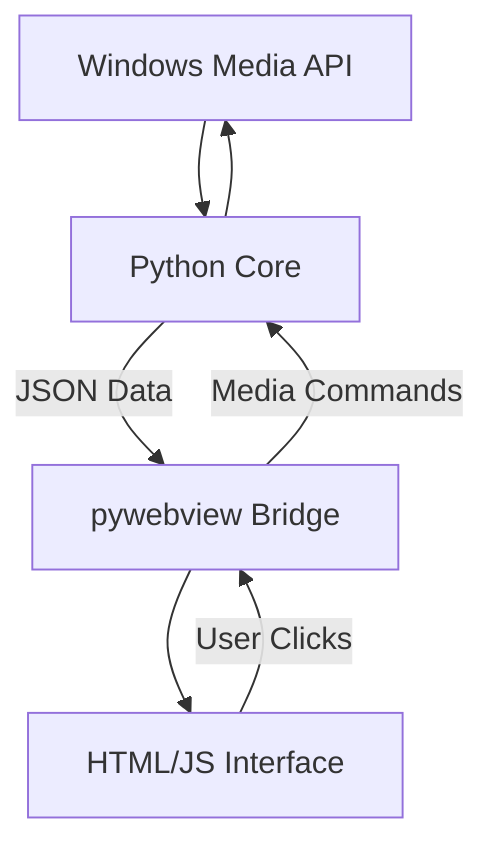

<div align="center">
  <h1>🎧 NeonPlayer</h1>
  <h3>Floating System Media Controller for Windows</h3>
  <p>
    <b>Glassmorphism UI • System Sync • Always-on-Top</b>
  </p>

  <p>
    
    
    
    
  </p>

  <br>

   


  <br><br>
</div>

---

## 🎵 What is NeonPlayer?

**NeonPlayer** is a lightweight, floating desktop widget that automatically syncs with your Windows system media session.

Whether you are listening to **Spotify, YouTube (Browser), VLC, or Apple Music**, NeonPlayer detects it instantly and gives you a beautiful, transparent glass control panel. It stays on top of your windows so you never have to Alt-Tab to skip a song.

---

## ✨ Key Features

| Feature | Description |
| :--- | :--- |
| 🎧 **System Sync** | Automatically connects to Spotify, Chrome, Edge, VLC, etc. |
| 🪟 **Glass UI** | Modern **Glassmorphism** design with blur effects. |
| 📌 **Always-on-Top** | Pin the widget so it floats over other apps. |
| 🎨 **6+ Themes** | Neon, Night, Cyber, Emerald, Sunset, Rose. |
| 💎 **Dynamic BG** | Album art is blurred and animated as the background. |
| ⚡ **Performance** | Asynchronous polling ensures 0% lag or CPU load. |

---

## 🏗️ Architecture

NeonPlayer uses a hybrid architecture to combine the power of Python with the beauty of Web Technologies.



* **Python (Backend):** Handles WinRT (Windows Runtime) APIs to read media status.
* **JavaScript (Frontend):** Manages animations, progress bars, and theme switching.
* **pywebview:** Acts as the bridge between Python logic and the UI.

---

## 📂 Project Structure

```text
NeonPlayer/
├── core/
│   ├── media_control.py    # Windows Media Transport Controls (WinRT)
│   ├── pin_logic.py        # Window pinning & positioning logic
│   └── __init__.py
│
├── web/                    # The Frontend Layer
│   ├── index.html          # Main UI Structure
│   ├── script.js           # Logic for UI updates & bridge calls
│   └── style.css           # Glassmorphism styles & animations
│
├── main.py                 # Entry point (Starts Python & WebView)
├── app_icon.ico            # App Icon
├── build.bat               # One-click build script
└── requirements.txt        # Python Dependencies

```

---

## 🚀 How to Run

### 1️⃣ Prerequisites

* Windows 10 or Windows 11 (Required for Media APIs).
* Python 3.8+.

### 2️⃣ Installation

```bash

# Create Virtual Environment (Optional but Recommended)
python -m venv venv
venv\Scripts\activate

# Install Dependencies
pip install -r requirements.txt

```

### 3️⃣ Start App

```bash
python main.py

```

---

## 📦 How to Build (.exe)

To create a standalone executable file that runs without Python installed:

1. Make sure you have `pyinstaller` installed:
```bash
pip install pyinstaller

```


2. Run the build script:
```bash
build.bat

```


3. Find your app in the `dist/` folder.

---

## 🎨 Controls & Shortcuts

* **Play/Pause:** Click the center button.
* **Seek:** Drag the progress bar.
* **Pin/Unpin:** Click the 📌 icon to toggle "Always on Top".
* **Change Theme:** Click the palette icon to cycle through themes.
* **Minimize:** The widget auto-compacts when media is paused for too long (configurable).

---

<div align="center">
<b>Built with ❤️ using Python & WinRT</b>
</div>

```

